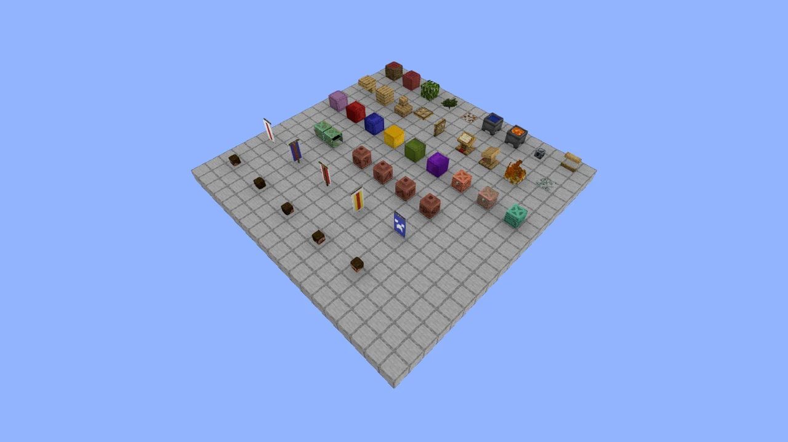

# Native preview rendering

This repository owns the renderer sources, including Cubane. Compatibility fixes
are implemented in TypeScript and tested before bundling. Installation and builds
do not rewrite dependency bundles.

The initial feature reference is Coastline Studio's `schematic-renderer` 1.6.1
compatibility script, five block-entity modules and Minecraft 26.2 preview settings.
Coastline itself is not switched to this repository by this change.



## Try the preview

```sh
npm ci
npm run dev:preview
```

Open `/preview.html`. The bundled, generated sample exercises block rendering,
orientations, decorated pots, copper chests, shulkers, banners and player heads.
Open a local `.schem`, `.schematic`, `.litematic` or `.nbt` file to inspect another
build. **Save image** exports a 1280 × 720 WebP; **Reopen preview** exercises teardown
and reuse of the shared resource context.

The example uses the exact Minecraft resource archive and default Steve skin from
Studio. Attribution and immutable hashes live in
[`test/public/minecraft-26.2-resources-NOTICE.txt`](../test/public/minecraft-26.2-resources-NOTICE.txt).
The pack is an example asset; it is not an application URL embedded in the library
and is not copied into the published library bundle.

Regenerate the public sample with `node scripts/generate-preview-fixture.mjs`.
It contains no private build data. Its schematic format is Sponge v2; block IDs
exercise the supplied 26.2 resources independently of the metadata data version.

## Embed the library

```ts
import {
	SchematicRenderer,
	SchematicRendererContext,
	createPreviewOptions,
} from "schematic-renderer";

const context = await SchematicRendererContext.create({
	vanilla: async () => (await fetch(resourcePackUrl)).blob(),
});

const renderer = new SchematicRenderer(
	canvas,
	{},
	{},
	createPreviewOptions({
		context,
		blockEntityOptions: {
			playerHeads: { defaultTextureUrl: defaultSkinUrl },
		},
		callbacks: {
			onRendererInitialized: async () => {
				const manager = renderer.schematicManager;
				if (!manager) throw new Error("Schematic manager is unavailable");
				await manager.loadSchematic("preview", schematicBytes, {
					focused: false,
				});
				await manager.getSchematic("preview")?.getMeshes();
				await renderer.cameraManager.focusOnSchematics({
					animationDuration: 0,
					padding: 0.1,
					useTightBounds: true,
				});
				renderer.invalidate();
			},
		},
	})
);

// On unmount. Keep the context alive only while other views need it.
renderer.dispose();
context.dispose();
```

`createPreviewOptions` returns fresh configurable settings: perspective camera,
solid blue background, WebGL, batched WASM meshing, gamma/SMAA/SSAO, pixel ratio
capped at two, and no automatic orbit, texture animation or editor controls.
Resource URLs, authorization, persistence and thumbnail uploads belong to the host.

## Block entities

The five default renderers run inside `SchematicObject` after block meshing. Their
output is included in `getMeshes()`, camera bounds and image captures. Rebuilding
replaces the output; cancellation and disposal release owned geometry, materials
and decoded images while preserving borrowed resource-pack textures.

| Renderer       | Supported details                                                                                                       |
| -------------- | ----------------------------------------------------------------------------------------------------------------------- |
| Player heads   | Standing/wall placement, rotation, legacy/modern profile NBT, skin and hat UVs, legacy skin transparency, fallback skin |
| Decorated pots | Four pottery sherd faces, blank sides and block orientation                                                             |
| Copper chests  | Oxidation/waxed variants, single/double models and orientation                                                          |
| Shulker boxes  | Undyed and 16 colors, all six facing directions                                                                         |
| Banners        | Standing/wall placement, base dye, legacy/modern pattern NBT and layered pattern compositing                            |

The active registry delegates supported blocks out of ordinary chunk geometry, so
they render once across mesh modes. `blockEntityOptions.enabled: false` restores
ordinary Cubane rendering. `includeDefaultRenderers: false` opts into a custom
registry. An entry in `renderers` with an existing `id` replaces that renderer;
each entry provides `supportsBlock(name)` and `render(context)` and returns an
idempotent disposer. Respect the supplied abort signal and filtered snapshot.

Player skins use the active pack's `entity/player/wide/steve` texture unless a
`defaultTextureUrl` is supplied. There are no external profile lookups by default,
matching Studio's current fallback-only behavior. Hosts may supply
`playerHeads.resolveTexture(reference)` to map a validated texture hash or profile
identifier to a `HeadTextureRequest`. The host owns that URL policy. Skin loading
retains bounded concurrency, a time budget, byte/dimension checks and fallback on
failure. Historical preview NBT aliases remain accepted alongside standard NBT.

The existing inspection/instance limits are retained for parity: 750,000 indexed
blocks; 256 heads, 512 pots, 1,024 copper chests, 1,024 shulkers and 512 banners.
At most 64 distinct custom skin requests and 128 banner appearances are rendered.
Missing entity resources may omit that entity renderer; diagnostic hooks are
available through `onError`.

## Source corrections

| Behavior                                                                         | Source owner                                                              |
| -------------------------------------------------------------------------------- | ------------------------------------------------------------------------- |
| Liquid models distinguished from cauldrons; water tint                           | `src/cubane/ModelResolver.ts`, `BlockMeshBuilder.ts`                      |
| Foliage, dry foliage and biome colormaps                                         | `src/cubane/TintManager.ts`, `AssetLoader.ts`                             |
| Symbolic and `{sprite}` texture references                                       | `src/cubane/ModelResolver.ts`                                             |
| Recursive multipart AND/OR conditions                                            | `src/cubane/ModelResolver.ts`                                             |
| Opaque/cutout/translucent material classification, including mangrove logs       | `src/cubane/AssetLoader.ts`                                               |
| Rotated occlusion; holes in cutout faces remain visible                          | `src/utils/occlusion.ts`, `src/WorldMeshBuilder.ts`                       |
| Opposite faces, coplanar emissive overlays and light-aware material batches      | `src/cubane/BlockMeshBuilder.ts`                                          |
| Implicit vanilla UVs in indexed and optimized geometry                           | `src/cubane/BlockMeshBuilder.ts`                                          |
| Conditional, correctly positioned and oriented lectern books                     | `src/cubane/Cubane.ts`                                                    |
| Explicit pack ownership, no stale Cubane auto-restore                            | `src/SchematicRenderer.ts`, `SchematicRendererContext.ts`                 |
| Watcher/listener cancellation, partial initialization and shared worker teardown | Renderer, render manager, schematic manager/object and world mesh builder |

The mangrove workaround is implemented as pixel-based opacity classification;
the trapdoor workaround is implemented as conservative cutout-face occlusion.
These rules work with other resource packs without name-specific exceptions.

## Verification and future integration

```sh
npx --no-install playwright install chromium # once per development machine
npm run verify
```

Verification covers formatting, lint, strict typechecking, unit/lifecycle tests,
the preview example, production ES/UMD bundles plus TypeScript declarations, and
a Chromium smoke test (five entity families, three reopens, file upload and image
export).
Behavior tests exercise actual source methods and Three.js geometry/materials;
the browser example remains the visual check for GPU output and resource packs.

For future Coastline adoption, consume a tested release of this repository and
remove Studio's bundle-patching scripts and duplicate entity renderers in the same
change. Keep API preview fetching, permissions and thumbnail persistence in Studio.
Use the same pack, camera, dimensions and render options when comparing images.

### Port verification (5 October 2026)

The generated sample was captured with both Studio's installed patched 1.6.1
bundle plus its entity extensions and this source implementation, using the same
resource pack, camera settings and 1280 × 720 WebP export. Visual inspection
confirmed matching geometry, orientation, textures and patterns. Mean absolute
RGB-channel difference was 0.211 on a 0–255 scale; 0.0075% of pixels differed by
more than 20 in any channel. This is evidence for the sample, not a promise of
pixel-identical output for every schematic, browser or GPU.
